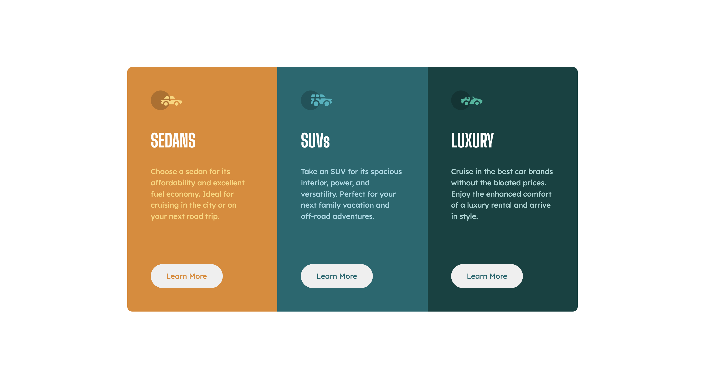

# 3-column preview card component 

This is a solution to the [3-column preview card component challenge on Frontend Mentor](https://www.frontendmentor.io/challenges/3column-preview-card-component-pH92eAR2-). Frontend Mentor challenges help you improve your coding skills by building realistic projects. 

## Overview

### The challenge

Users should be able to:

- View the optimal layout depending on their device's screen size
- See hover states for interactive elements

### Screenshot

### Links

- [GitHub repo](https://github.com/Aymmaann/Front-End-Development/tree/main/3-column%20preview%20card%20component)
- [Live Site](https://preview-card-component-fe-mentor.netlify.app/)

## My process

### Built with

- Semantic HTML5 markup
- CSS custom properties
- Flexbox
- Mobile-first workflow
- [Google Fonts](https://fonts.google.com/) - For fonts

### What I learned

In this project, I learned how to:

- Use CSS custom properties to define colors and other reusable values.
- Implement a mobile-first approach to ensure a responsive design.
- Utilize Flexbox for layout design and positioning of elements.
- Create hover effects for interactive elements using CSS.

### Continued development

In future projects, I aim to focus more on:

- Enhancing my understanding of CSS Grid for more complex layouts.
- Exploring advanced CSS techniques like animations and transitions.
- Improving accessibility features in my designs to ensure inclusivity.

### Continued development

I want to continue focusing on improving my CSS skills, especially in the areas of layout and responsiveness.

## Author

- Website - [My portfolio](https://ayman03-portfolio.netlify.app/)
- Frontend Mentor - [@Aymmaann](https://www.frontendmentor.io/profile/Aymmaann)

## Acknowledgments

I'd like to thank Frontend Mentor for providing such challenging projects to practice my skills. Also, a shoutout to the online coding communities for their support and valuable feedback.

