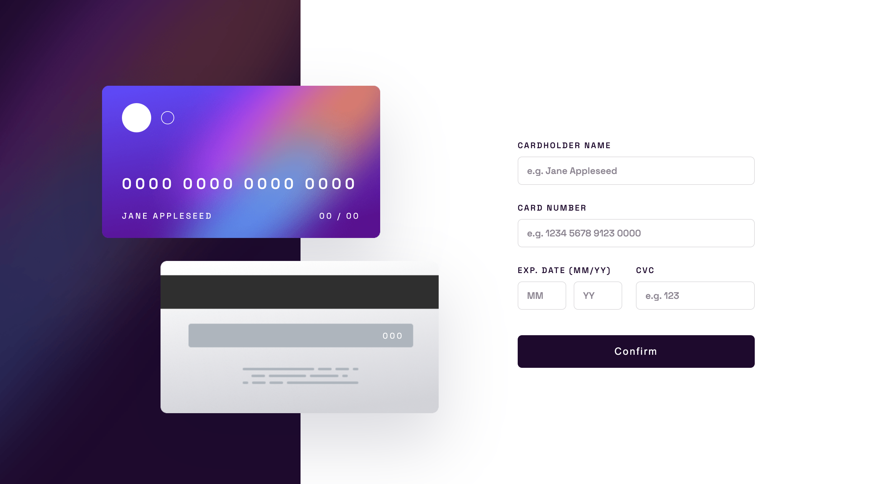

# Interactive Card Details Form 

This is a solution to the [Interactive card details form challenge on Frontend Mentor](https://www.frontendmentor.io/challenges/interactive-card-details-form-XpS8cKZDWw). Frontend Mentor challenges help you improve your coding skills by building realistic projects. 

## Overview

### The Challenge

Users should be able to:

- Fill in the form and see the card details update in real-time
- Receive error messages when the form is submitted if:
  - Any input field is empty
  - The card number, expiry date, or CVC fields are in the wrong format
- View the optimal layout depending on their device's screen size
- See hover, active, and focus states for interactive elements on the page

### Screenshot

### Links

- [GitHub repo]](https://github.com/Aymmaann/Front-End-Development/tree/main/Interactive%20card%20details%20form)
- [Live Site]()

## My Process

### Built With

- Semantic HTML5 markup
- CSS custom properties
- Flexbox
- CSS Grid
- Mobile-first workflow
- JavaScript

### What I Learned

- Implementing real-time form validation using JavaScript
- DOM manipulation for error handling and updating UI
- Responsive design techniques for optimal layout across devices

### Continued Development

- Enhancing accessibility features such as screen reader compatibility
- Improving UI/UX for better user interaction and feedback

### Useful resources

- [MDN Web Docs](https://developer.mozilla.org/) - This website provides comprehensive documentation for web technologies and helped me understand JavaScript concepts.
- [CSS-Tricks](https://css-tricks.com/) - This website has a lot of useful articles and tutorials on CSS, which helped me with styling and layout.

## Author

- Website - [My portfolio](https://ayman03-portfolio.netlify.app/)
- Frontend Mentor - [@Aymmaann](https://www.frontendmentor.io/profile/Aymmaann)

## Acknowledgments

I'd like to thank Frontend Mentor for providing such challenging projects to practice my skills. Also, a shoutout to the online coding communities for their support and valuable feedback.
