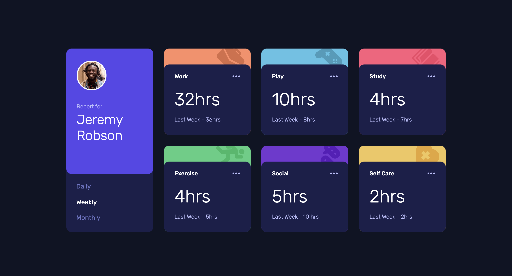

# Time Tracking Dashboard

This is a solution to the [Time tracking dashboard challenge](https://www.frontendmentor.io/challenges/time-tracking-dashboard-UIQ7167Jw) on Frontend Mentor. Frontend Mentor challenges help you improve your coding skills by building realistic projects.

## Table of Contents

- [Overview](#overview)
  - [The Challenge](#the-challenge)
  - [Screenshot](#screenshot)
  - [Links](#links)
- [My Process](#my-process)
  - [Built With](#built-with)
  - [What I Learned](#what-i-learned)
  - [Continued Development](#continued-development)
  - [Useful Resources](#useful-resources)
- [Author](#author)
- [Acknowledgments](#acknowledgments)

## Overview

### The Challenge

Users should be able to:

- View the optimal layout for the site depending on their device's screen size
- See hover states for all interactive elements on the page
- Switch between viewing Daily, Weekly, and Monthly stats

### Screenshot

### Links

- [GitHub Repo](https://github.com/Aymmaann/Front-End-Development/tree/main/Time%20tracking%20dashboard)
- [Live Site]()

## My Process

### Built With

- Semantic HTML5 markup
- CSS custom properties
- Flexbox
- CSS Grid
- Mobile-first workflow
- JavaScript

### What I Learned

Throughout this project, I deepened my understanding of responsive design, JavaScript event handling, and data manipulation. I gained practical experience in creating layouts that adapt to different screen sizes, responding to user interactions dynamically, and updating content based on fetched data.

### Continued Development

Moving forward, I aim to further enhance my skills in CSS animations and transitions to create smoother and more polished user experiences. Additionally, I plan to explore more advanced JavaScript techniques, such as using ES6 features and modularizing code for better maintainability. This project has inspired me to delve deeper into frontend development and continue refining my abilities.

### Useful resources

- [MDN Web Docs](https://developer.mozilla.org/) - This website provides comprehensive documentation for web technologies and helped me understand JavaScript concepts.
- [CSS-Tricks](https://css-tricks.com/) - This website has a lot of useful articles and tutorials on CSS, which helped me with styling and layout.

## Author

- Website - [My portfolio](https://ayman03-portfolio.netlify.app/)
- Frontend Mentor - [@Aymmaann](https://www.frontendmentor.io/profile/Aymmaann)

## Acknowledgments

I'd like to thank Frontend Mentor for providing such challenging projects to practice my skills. Also, a shoutout to the online coding communities for their support and valuable feedback.
